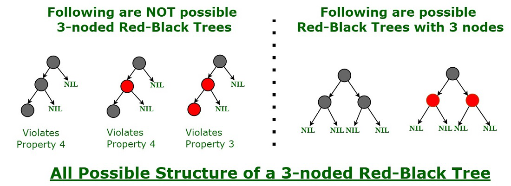

# FT_CONTAINERS
FT_CONTAINERS is a project from the 42 school in c++ with the goal:
- Recreate the container vector and its iterators
- Recreate the container stack
- Recreate the container map and its iterators

#	SUMMARY
## [1. VECTOR](https://github.com/vbachele/ft_containers#vector)
- ####	[**Documentations**](https://github.com/vbachele/ft_containers#useful-links)
- ####	[**Canonical form**](https://github.com/vbachele/ft_containers#canonical-form)
- ####	[**Capacity**](https://github.com/vbachele/ft_containers#capacity-functions)
- ####	[**Element access**](https://github.com/vbachele/ft_containers#element-access)
- ####	[**Modifiers**](https://github.com/vbachele/ft_containers#modifiers-functions)
- ####	[**Iterators**](https://github.com/vbachele/ft_containers#iterators)
## [2. STACK](https://github.com/vbachele/ft_containers#stack)
## [3. MAP](https://github.com/vbachele/ft_containers#map)
## [4. OTHER FUNCTIONS](https://github.com/vbachele/ft_containers#other-functions)

**In this project you will learn how to do the ft_container 42 project**
*If you like it don't forget to put a star !*

## Useful links
### General links
- [What is a namespace](https://www.geeksforgeeks.org/namespace-in-c/#:~:text=Namespace%20is%20a%20feature%20added,the%20same%20name%20are%20allowed.)
- [What is a template](https://www.geeksforgeeks.org/templates-cpp/)
- [What is the keyword typedef](https://en.cppreference.com/w/cpp/language/typedef)
- [What is explicit keyword](https://www.geeksforgeeks.org/use-of-explicit-keyword-in-cpp/#:~:text=Explicit%20Keyword%20in%20C%2B%2B%20is%20used%20to%20mark%20constructors,can%20be%20used%20in%20typecasting.)

### Vector links
- [All vector functions](https://cplusplus.com/reference/vector/vector/)
- [Deallocate memory](https://en.cppreference.com/w/cpp/memory/allocator/deallocate)
- [allocate memory](https://cplusplus.com/reference/memory/allocator/allocate/)
- [How works max size](https://stackoverflow.com/questions/3813124/c-vector-max-size)
- [Introduction to Iterator](https://www.geeksforgeeks.org/introduction-iterators-c/)
- [what are iterator and how to create it](https://www.internalpointers.com/post/writing-custom-iterators-modern-cpp)
- [What is iterator trait](https://www.boost.org/sgi/stl/iterator_traits.html)
- [Nested class](https://www.geeksforgeeks.org/nested-classes-in-c/#:~:text=A%20nested%20class%20is%20a,access%20rules%20shall%20be%20obeyed.)
- [How works this](https://www.javatpoint.com/cpp-this-pointer#:~:text=In%20C%2B%2B%20programming%2C%20this%20is,be%20used%20to%20declare%20indexers.)
- [man reverse iterator](https://en.cppreference.com/w/cpp/iterator/reverse_iterator)

## VECTOR

### How to do vector?
Begin by the beggining and read the [man](https://cplusplus.com/reference/vector/vector/).
I'm using template inside my hpp document. All my functions are in the hpp doc
The project is divided into 5 parts:
- **Canonical form**
- **Iterators**
- **Capacity**
- **Element access**
- **Modifiers**

#### Canonical Form
You have to create constructor, that means you need to:

- **Declare your private variables**
	- Your allocator for the allocation of the memory for your vector,
	- The size of the vector.
	- The capacity for your memory (You can have a buffer to improve performance for your machine)
	- A pointer to your vector.
- **Create the constructor functions**
	- Be sure you allocate the memory for your new vector.
- **Create the desctructor functions**
	- Be sure you free the memory allowed from your vector.
- **Create the assign content functions**
	- Be sure you free the memory from the vector which will be copied.
	- Be sure you allocate the memory from the memory allocated you are copying

#### Capacity functions
- **Max_size**
	- For the function max_size, i let you check this [documentation](https://en.cppreference.com/w/cpp/types/numeric_limits/max)
- **reserve**
	- You need to check if you current capacity if lesser than the number sent into the function. [Man of reserve](https://cplusplus.com/reference/vector/vector/reserve/)
	- If (n > capacity)
		You have to:
		- Create a new tmp array
		- Allocate the new size
		- Construct your new array and destroy your old one at the same time
		- Then deallocate your capacity
- **resize**
- [man of resize](https://cplusplus.com/reference/vector/vector/resize/)
	- If n > You capacity, you have to use the reserve function
	- If n < your size, you have to destroy memory
	- If n > your size, you have to allocate memory and the value

#### Element Access
Nothing particular for this one, just return the value, these functions will allow you to test your program

#### Modifiers functions
There are functions where you don't need the iterators. Be sure, you have done at least capacity and element access to begin.
- [**assign**](https://en.cppreference.com/w/cpp/container/vector/assign)
	- Don't forget to destroy the memory of your old content with clear.
	- Construct your new array to give the value and memory.
	- For the assign function with iterator first and last, create a function *iterator distance* to calculate 		the distance between the 2 iterators in order to fill your vector.
- [**swap**](https://en.cppreference.com/w/cpp/algorithm/swap)
	- To save time, use directly the function swap from the std.to change all the values [Man here](https://cplusplus.com/reference/vector/vector/swap/)
- [**clear**](https://en.cppreference.com/w/cpp/container/vector/clear)
	- Don't forget to destroy the memory also.
	- Put size to 0.
- [**push_back**](https://en.cppreference.com/w/cpp/container/vector/push_back)
	- If capacity == 0 or > size don't forget to handle this case otherwise your have to allocate for the new 	value.
	- Add size++;
- [**insert**](https://en.cppreference.com/w/cpp/container/vector/insert)
Insert has 3 dedicated functions.
	- You have to:
		- Check if size = 0.
		- Use your reserve function if size > capacity.
	- You have to shift your value from 1
	- You add the value of your tmp at the following of your vector
Let's see it in code.

```c
template <class T, class Alloc>
void vector<T, Alloc>::insert(iterator position, size_type n,
							const value_type& val)
{
	size_type index = position - this->begin();
	if (n)
	{
		if (this->size() + n > this->capacity())
		{
			reserve((this->size() + n) * 1.5);
		}
		for (size_type i = this->_size; i > index; i--)
		{
			this->_alloc.construct(this->_array + i + n - 1, *(this->_array + i -1)); // you shift and contruct the value on the right to prepare the insertion on the right index of your vector.
			this->_alloc.destroy(this->_array + i - 1);
		}
		for (size_type i = 0; i < n; i++)
		{
			this->_alloc.construct(this->_array + index + i, val); // Here I insert my new value
			this->_size++;
		}
	}
}
```

### Iterators
Iterators are the tricky part of this project. For my part I created a Vector_Iterator.hpp file, Reverse_iterator.hpp and Iterator_traits.hpp for vector
To undestand how create your first own iterator, use this really insteresting [tutorial](https://www.internalpointers.com/post/writing-custom-iterators-modern-cpp)

#### Vector_iterator
You will need to create the vector_iterator class and the reverse_iterator class.
vector_iterator will be used for almost all your function, it will allow to do operators (++, --, ==, += etc...).
1. Create your typedef as the tutorial mentionned just above it explains a lot of things.
2. Create your constructor and destructor.
3. Create all your operators functions, you will need it when you will use your iterator.

1. Create your Iterators.hpp file
You can find my class in the Iterators.hpp file.
```c
template <class T>
class vector_iterator
{
	public :
		typedef std::random_access_iterator_tag iterator_category; //tag of our iterator, we will be able to write, read, go the end of our vector and go from the end to the beginning
		typedef std::ptrdiff_t					difference_type; // use to identify distance between iterators steps
		typedef T								value_type;
		typedef value_type*						pointer;
		typedef value_type&						reference;
```
- At the end, you will be able to do this.
```c
STD::vector <int> fill_vector(4, 500); // creting the vector of size = 4 filled with 500;
STD::vector<int>::iterator it = fill_vector.begin(); // declaring my iterator at the beginning of vector
std::cout << *it << std::endl; // It displays the first 500
```

#### Reverse_iterator
- [What is iterator trait](https://www.boost.org/sgi/stl/iterator_traits.html)
- [Nested class](https://www.geeksforgeeks.org/nested-classes-in-c/#:~:text=A%20nested%20class%20is%20a,access%20rules%20shall%20be%20obeyed.)
- [How works "this"](https://www.javatpoint.com/ cpp-this-pointer#:~:text=In%20C%2B%2B%20programming%2C%20this%20is,be%20used%20to%20declare%20indexers.)
- [man reverse iterator](https://en.cppreference.com/w/cpp/iterator/reverse_iterator)

Here is the last difficult part about vector, doing the reverse_iterator.
You are maybe asking yourself what is this, how it works. I will try to explain.
**What is reverse iterator**
Reverse_iterator is an iterator adaptor that reverses the direction of a given iterator.

1. **Create a new class reverse_iterator**
- Indeed you have to declare new variables according to the [man](https://en.cppreference.com/w/cpp/iterator/reverse_iterator).
```c
template<class Iterator>
class reverse_iterator
{
public:
	typedef Iterator 							iterator_type;
	typedef typename iterator_traits<iterator_type>::iterator_category	iterator_category;
	typedef typename iterator_traits<iterator_type>::value_type		value_type;
	typedef typename iterator_traits<iterator_type>::difference_type	difference_type;
	typedef typename iterator_traits<iterator_type>::pointer		pointer;
	typedef typename iterator_traits<iterator_type>::reference		reference;
```
- **explaining the code above**
As you can see, you need to define as before your iterator, pointer etc... but it is more complicated. You need to create another class iterator trait (*you can find the class in my file iterator_traits*).
Iterator trait ([man here](https://en.cppreference.com/w/cpp/iterator/iterator_traits)) is the type trait class that provides uniform interface for random_access_iterator.
```c
iterator_traits<iterator_type>::iterator_category
// iterator_type means my iterator previously defined in vector_iterator
// iterator_traits<iterator_type>::iterator_category // means i am gonna take the iterator_category from iterator_traits class
```

2. **Iterator_Traits class **
- According to the man you need to create 3 class, our 1st class will take an template "iterator".
That means we will send our vector_iterator we created before on it.
```c
/*** We define the iterator trait here ***/
template <class Iterator>
class iterator_traits
{
public:
	typedef typename Iterator::iterator_category iterator_category;
	typedef typename Iterator::value_type        value_type;
	typedef typename Iterator::difference_type   difference_type;
	typedef typename Iterator::pointer           pointer;
	typedef typename Iterator::reference         reference;
};
```
- Our Iterator will take the iterator_category we previously defined in our vector_iterator.
That what means *Iterator::iterator_category* for example in english, we are looking for iterator_category from Iterator.
- We also need a class for pointer T*.
```c
/*** The second iterator trait is for the case you have a pointer ***/
template <class T>
class iterator_traits<T *>
{
public:
	typedef std::random_access_iterator_tag 	iterator_category;
	typedef T                         			 value_type;
	typedef std::ptrdiff_t                 		difference_type;
	typedef T*									pointer;
	typedef T&                        			reference;
};
```

3. **Create all your members functions**

- Don't forget because it is reverse, when you have your operator+ for example, you have to do -
```c
reverse_iterator operator+(difference_type n) const
{
	return (reverse_iterator (_ptr - n));
}
```
## STACK
You have the [man here](https://en.cppreference.com/w/cpp/container/stack)
Honestly nothing difficult. You are passing your vector container in template so that you can reuse it to do all the functions.

## MAP
### Documentation
- [Man MAP](https://en.cppreference.com/w/cpp/container/map)
- [Compare](https://en.cppreference.com/w/cpp/named_req/Compare)
- [std::less](https://en.cppreference.com/w/cpp/utility/functional/less)
- [value-compare](https://en.cppreference.com/w/cpp/container/map/value_compare)
- [Understand a red black tree](https://algorithmtutor.com/Data-Structures/Tree/Red-Black-Trees/)
- [Other introduction to red black tree](https://www.geeksforgeeks.org/red-black-tree-set-1-introduction-2/)
- [Insertion in a red black tree](https://www.geeksforgeeks.org/red-black-tree-set-2-insert/)
- [Deletion in a red black tree](https://www.geeksforgeeks.org/red-black-tree-set-3-delete-2/)
- [red black tree virtualization](https://www.cs.usfca.edu/~galles/visualization/RedBlack.html)

### RED BLACK TREE
A red-black tree T is a binary search tree having following **five additional properties** (invariants).

1. Every node in T is either red or black.
2. The root node of T is black.
3. Every NULL node is black. (NULL nodes are the leaf nodes. They do not contain any keys. When we search for a key that is not present in the tree, we reach the NULL node.)
4. If a node is red, both of its children are black. This means no two nodes on a path can be red nodes.
5. Every path from a root node to a NULL node has the same number of black nodes.



#### Insert in a red black tree
Algorithm in pseudo code:
Let x be the newly inserted node.

1. Perform standard BST insertion and make the colour of newly inserted nodes as RED.
2. If x is the root, change the colour of x as BLACK (Black height of complete tree increases by 1).
3. Do the following if the color of x’s parent is not BLACK and x is not the root.
a) If x’s uncle is RED (Grandparent must have been black from property 4)
(i) Change the colour of parent and uncle as BLACK.
(ii) Colour of a grandparent as RED.
(iii) Change x = x’s grandparent, repeat steps 2 and 3 for new x.
b) If x’s uncle is BLACK, then there can be four configurations for x, x’s parent (p) and x’s grandparent (g) (This is similar to AVL Tree)
(i) Left Left Case (p is left child of g and x is left child of p)
(ii) Left Right Case (p is left child of g and x is the right child of p)
(iii) Right Right Case (Mirror of case i)
(iv) Right Left Case (Mirror of case ii)

## OTHER FUNCTIONS

### [Equal](https://en.cppreference.com/w/cpp/algorithm/equal)
Equal will check if 2 range of iterators are equal, if not return false, if yes return true.

### [Lexicographical compare](https://en.cppreference.com/w/cpp/algorithm/lexicographical_compare)
Lexicographical comparison is an operation with the following properties:

- Two ranges are compared element by element.
- The first mismatching element defines which range is lexicographically less or greater than the other.
- If one range is a prefix of another, the shorter range is lexicographically less than the other.
- If two ranges have equivalent elements and are of the same length, then the ranges are lexicographically equal.
- An empty range is lexicographically less than any non-empty range.
- Two empty ranges are lexicographically equal.

### [Pair](https://en.cppreference.com/w/cpp/utility/pair)
std::pair is a class template that provides a way to store two heterogeneous objects as a single unit. A pair is a specific case of a std::tuple with two elements.